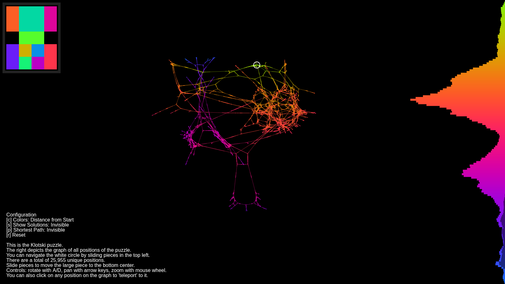

# Klotski-Webpage
Stable version of the Klotski graph viewer site. Desktop only, may be laggy even with a beefy system.

This project is no longer maintained.
Note: the starting position displayed here is the one which was presented to me when I first saw this puzzle, it is slightly different (4 moves away) from the standard starting position (as recognized by world record organizations such as Guinness.)
This graph was created with my Old-Graph-Spreader repository, which is no longer maintained and has been largely ported into Swaptube.
